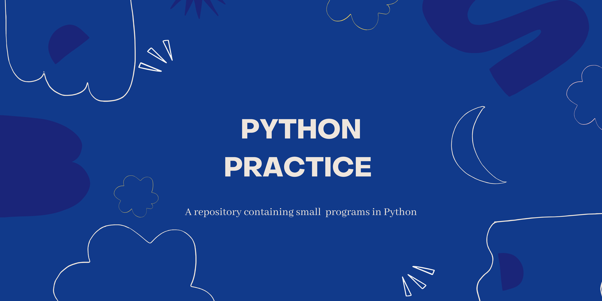

# Python-Practice
This repo consists of the practice codes and notes

` Notebook : `
Contains the practice for Jupyter Notebook.

` python : `
Contains the practice for Python code.

` Miscellaneous : ` 
Books and other informatics.

` 100Days :`
Trying to get the practice of python in my ever-going journey to code!

_If you found this useful, give it a ⭐
connect with me on [Twitter](https://twitter.com/whatshivashi)!_